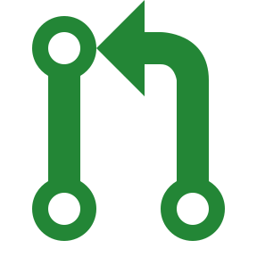
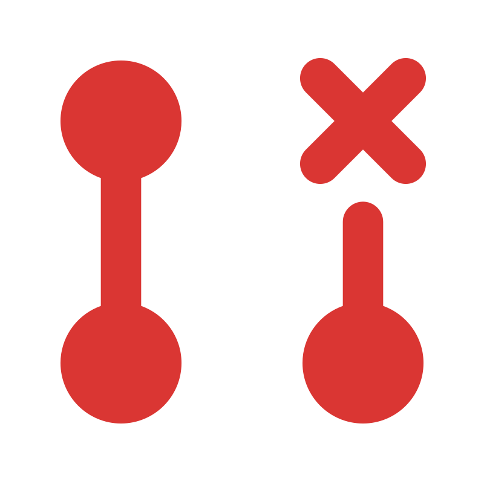
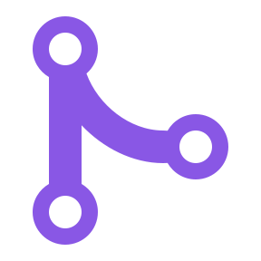

<b>Hi there</b> 👋

🔭 I’m currently looking for oppotunities in Full stack developement 

🌱 I’m currently learning NestJS, Recoil, Prisma, GraphQL

💬 Ask me about React | NodeJS | TypeScript

📫 How to reach me: twitter.com/adityapimpalkar

### My contributions

 <a href='https://github.com/twentyhq/twenty/pull/1858'>feat: Board options edit and reorder</a>
 
 <a href='https://github.com/twentyhq/twenty/pull/1964'>feat: insert images to notes</a>
 
 <a href='https://github.com/twentyhq/twenty/pull/1738'>Chore: Improve dropdown draggable list</a>
 
 <a href='https://github.com/twentyhq/twenty/pull/1699'>feat: reorder kanban columns</a>
 
 <a href='https://github.com/twentyhq/twenty/pull/1616'>feat: Column title menus</a>
